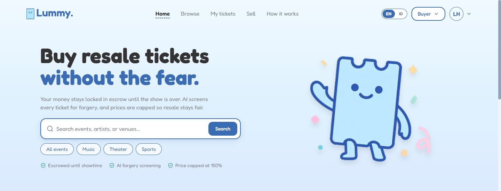
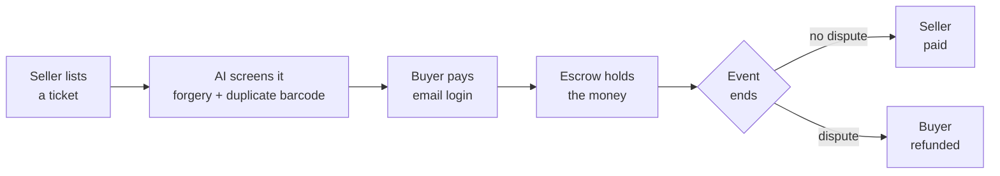

**Escrow-backed resale for Indonesian concert tickets.**

Buyer money is locked by a smart contract and released to the seller after the event.
Tickets here are name-locked, so we generate the signed authorization letter too.
No wallet, no seed phrase, no gas fee.

[<kbd>   Live demo &nbsp;→   </kbd>](https://lummy-ticket.vercel.app)
&nbsp;
[<kbd>   Deck &amp; links &nbsp;→   </kbd>](https://linktr.ee/lummyticket)

 

 

---

## The problem

Buyers pay first, then get ghosted, handed a fake ticket, or one that has already been scanned. Deals happen in WhatsApp groups and X replies with nobody in the middle. Scalping around one national-team match cost fans roughly **$3.9M**, and Coldplay Jakarta 2023 produced **60+ documented fraud victims**.

What makes Indonesia different is that tickets are **name-locked**. The QR is exchanged for a wristband against a government ID at the gate, so a ticket cannot simply change hands. A legal transfer needs an authorization letter, an ID copy, and an e-stamp, and today people assemble that by hand in a group chat.

That friction is why nobody has won this category locally. It is also the moat: automate the paperwork and you own the trust layer.

## How it works

### The money

The seller cannot take the money and disappear, because the money was never theirs to take. Resale is capped at 150% of face value, so scalping does not pay either.

### The tickets

Every uploaded ticket runs three checks before it can go on sale:

- **Autofill.** The PDF is parsed into structured fields, so listing takes seconds instead of manual typing.
- **Duplicate barcode.** The barcode is decoded, normalised, and hashed, then matched against every other listing. An already-sold ticket is blocked outright. This check is deterministic, not a guess.
- **Forgery score.** PDF structure forensics look for edit traces, with a vision model as a second layer.

> [!NOTE]
> What we do not claim: the forgery score is a review signal, not a gate, and a cleanly edited fake can still pass it. Without organizer integration our guarantee is that **your money comes back**, not that you are guaranteed entry. What actually protects the buyer is the escrow and the signed authorization letter.

## Why now

- **Live events are booming** in Indonesia post-2023, with K-pop tours and international festivals entering the market.
- **QRIS is everywhere**, so a mainstream payment rail finally exists that needs no crypto on-ramp.
- **2026 data-protection rules** are pushing the market away from photocopied IDs and toward verified identity, which is the model we already built for.

## Shipped

**Lummy v1 on Lisk (2025).** On-chain primary ticketing, deployed. EIP-2535 Diamond contracts across 5 facets, stablecoin escrow, NFT tickets, and anti-scalping rules enforced in contract code. → [lummy-smart-contracts](https://github.com/Lummy-Ticket/lummy-smart-contracts)

What we learned: visible Web3 kills adoption. Wallets, gas fees, and signing popups stopped ordinary fans who just wanted a ticket. We then aimed at a full ticketing marketplace and found it far bigger than the problem required.

## Building

**Escrow resale on Monad (2026).** The same escrow guarantee, with the crypto entirely invisible. Email login, local payment, auto-generated authorization letters. The prototype is [live](https://lummy-ticket.vercel.app) with the full buyer and seller flow; the escrow contract is in development.

We kept blockchain in exactly one place: holding the money. For a sale between two strangers, a public contract beats our own bank account, because anyone can verify it and there are no chargebacks.

The full ticketing marketplace we started is [paused](https://lummy-new.vercel.app), not abandoned. It resumes once resale earns the trust and the liquidity.

## Stack

| Layer | What we use |
|---|---|
| **App** | Next.js and TypeScript on Vercel, with Supabase for Postgres, auth, storage, and row-level security |
| **Chain** | Solidity and Foundry. Escrow on Monad, an EVM L1. v1 shipped on Lisk |
| **AI** | PDF structure forensics, barcode decoding with hash-based dedup, forgery scoring |
| **Identity** | e-KYC, e-signature, and e-stamp through a licensed Indonesian PSrE, so raw ID images never sit with us |
| **Money** | QRIS settles through a licensed payment provider. In production the provider holds the funds, never the chain |

## Where we are

- **$4,600 grant** from [Lisk Spark](https://liskspark.com), Indonesia's first government-supported Web3 incubator
- **Top 5 of 34** at Lisk Builders Challenge Round One, plus the Social Media Challenge win (May 2025)
- **Pilot LOIs signed with 10+ event organizers**, the largest drawing around 7,000 attendees at its last festival (CRSL, Yogyakarta)
- **1.4M Instagram views and 85K interactions** across our channels, last 90 days

## Repositories

**[lummy-smart-contracts](https://github.com/Lummy-Ticket/lummy-smart-contracts)** carries the on-chain ticketing system: EIP-2535 Diamond, 5 facets, escrow, marketplace, staff roles (Solidity, Foundry)

**[lummy-frontend](https://github.com/Lummy-Ticket/lummy-frontend)** is the v1 Web3 app (React, TypeScript, Wagmi)

## Team

Zara Sasongko, CEO · [LinkedIn](https://www.linkedin.com/in/zara-sasongko-a08292271/)

Luthfi Hadi, CTO · [@luthfidi](https://github.com/luthfidi) · [LinkedIn](https://linkedin.com/in/luthfi-hadi)

Joanita Timbin Panggalo, COO · [LinkedIn](https://www.linkedin.com/in/joanitatimbin/)

Jakarta, Indonesia · lummyticket@gmail.com · [Instagram](https://instagram.com/lummy.ticket) · [X](https://x.com/lummy_ticket) · [LinkedIn](https://linkedin.com/company/lummy-ticket)
