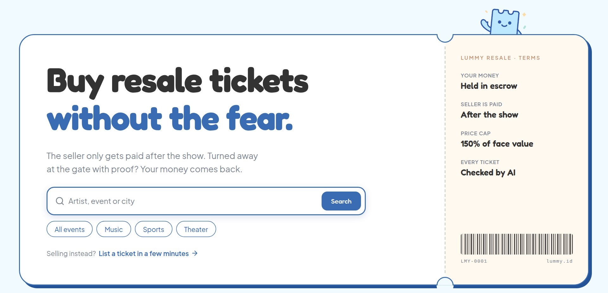
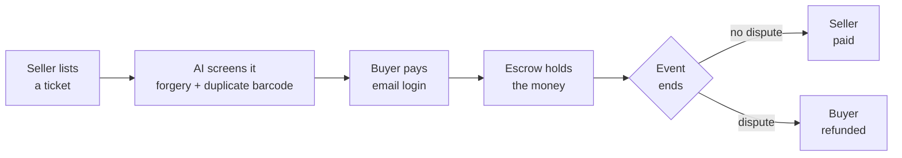

**Escrow-backed resale for Indonesian concert tickets.**

Buyer money is locked by a smart contract on Arbitrum and released to the seller after the event.
Tickets here are name-locked, so we generate the authorization letter too.
No wallet, no seed phrase, no gas fee.

[<kbd>   Live demo &nbsp;→   </kbd>](https://lummy.id)
&nbsp;
[<kbd>   How it works &nbsp;→   </kbd>](https://lummy.id/how-it-works)

 

 

---

## The problem

Buyers pay first, then get ghosted, handed a fake ticket, or one that has already been scanned. Deals happen in WhatsApp groups and X replies with nobody in the middle. After Coldplay's 2023 show in Jakarta, ticket-fraud victims reported losses of up to Rp1.3 billion to the police ([Kompas TV](https://www.kompas.tv/nasional/461179/korban-penipuan-tiket-konser-coldplay-lapor-polisi-kerugian-hingga-rp1-3-miliar)), and the trade ministry questioned the promoter over consumer ticket complaints ([Bisnis.com](https://ekonomi.bisnis.com/read/20231203/12/1720382/kemendag-cecar-promotor-soal-aduan-tiket-konser-coldplay-rugikan-konsumen)).

What makes Indonesia different is that tickets are **name-locked**. The QR is exchanged for a wristband against a government ID at the gate, so a ticket cannot simply change hands. A legal transfer needs an authorization letter, an ID copy, and an e-stamp, and today people assemble that by hand in a group chat.

That friction is why nobody has won this category locally. It is also the moat: automate the paperwork and you own the trust layer.

## How it works

### The money

The seller cannot take the money and disappear, because the money was never theirs to take. If nobody raises a problem within 48 hours of the event ending, the seller is paid automatically. Resale is capped at 150% of face value, so scalping does not pay either.

### The tickets

Every listing is checked before it can go on sale:

- **Autofill.** The PDF is parsed into structured fields, so listing takes seconds instead of manual typing.
- **Duplicate barcode.** The barcode is decoded, normalised, and hashed, then matched against every other listing. An already-sold ticket is blocked outright, and the escrow contract itself rejects a ticket commitment it has seen before.
- **Forgery score.** PDF structure forensics look for edit traces, with a vision model as a second layer.

The prototype runs these checks on sample tickets while the pipeline for real PDFs is being connected. The duplicate-commitment check inside the contract already runs on testnet.

> [!NOTE]
> What we do not claim: the forgery score is a review signal, not a gate, and a cleanly edited fake can still pass it. Without organizer integration our guarantee is that **your money comes back**, not that you are guaranteed entry. What actually protects the buyer is the escrow and the authorization letter.

## Every step on chain, in plain words

An escrow's history is read straight from the contract's events on Arbitrum, not from our database, and shown as plain sentences: money locked, handover recorded, claim filed, paid out. Each step links to its transaction as proof. Anyone can open an escrow's public proof page without an account, and the page holds no personal data. [See one that settled on Arbitrum Sepolia](https://lummy.id/proof/0xc9b869a2c8bba81a4e564ea2126c0651ecef9ddd612d94bd8818cca1f20666bc).

## Why escrow, and why Arbitrum

We spent a year on this problem before settling on the product. Our first build was full on-chain ticketing, and it taught us two things. Visible Web3 stops ordinary fans: wallets, gas fees, and signing pop-ups lost people who just wanted a ticket. And a full ticketing platform was far bigger than the problem fans actually have, which is getting cheated when they buy from a stranger.

So we kept blockchain in exactly one place: holding the money. For a sale between two strangers, a public contract beats our own bank account, because its rules and its history are open and there are no chargebacks. We call it consumer escrow: the money is held by a contract and released by what happens at the gate, for buyers who never see a wallet.

The contract runs on Arbitrum, an Ethereum L2, so it settles to Ethereum and holds USDC issued by Circle. Users sign in with email; the platform submits the transactions and pays the gas.

## Why now

- **Live events are booming** in Indonesia post-2023, with K-pop tours and international festivals entering the market.
- **QRIS is everywhere**, so a mainstream payment rail finally exists that needs no crypto on-ramp.
- **Indonesia's data-protection law (UU PDP)** is pushing the market away from photocopied IDs and toward verified identity, which is the model we designed for.

## Where we are

- **Live prototype** at [lummy.id](https://lummy.id): email sign-in, and buyer, seller, and admin flows backed by a real database, including claims where the seller gets a right of reply, in English and Indonesian. Payment is simulated until the payment provider is connected.
- **Escrow contract** on Arbitrum: 81 tests and an invariant campaign of 640,000 random actions. Once the window after an event closes without a dispute, nobody can stop the seller's payout, including us. [Deployed on Arbitrum Sepolia](https://sepolia.arbiscan.io/address/0x6830Db86283157E4cB80b0615d4c51381A0C25Dd) with Circle USDC, where release, refund, and dispute have all run on chain.
- **Public proof pages** for every on-chain escrow, built from contract events.
- **Production path in Indonesia**: crypto is not legal tender there, so users will pay in rupiah through QRIS, a licensed payment provider holds the funds, and the chain serves as the escrow ledger.

## Stack

| Layer | What we build with |
|---|---|
| **App** | Next.js and TypeScript on Vercel. Supabase for Postgres, auth, storage, and row-level security |
| **Chain** | Solidity and Foundry. Escrow on Arbitrum, an Ethereum L2. Deposits in Circle USDC through ERC-3009, gas paid by the platform |
| **AI** | PDF structure forensics, barcode decoding with hash-based dedup, forgery scoring. The prototype runs them on sample tickets |
| **Identity** | Planned: e-KYC, e-signature, and e-stamp through a licensed Indonesian PSrE, so raw ID images never sit with us |
| **Money** | Planned: QRIS through a licensed payment provider. In production the provider holds the funds, never the chain |

## Team

Zahra Sasongko, CEO · [LinkedIn](https://www.linkedin.com/in/zara-sasongko-a08292271/)

Luthfi Hadi, CTO · [@luthfidi](https://github.com/luthfidi) · [LinkedIn](https://linkedin.com/in/luthfi-hadi)

Joanita Timbin Panggalo, COO · [LinkedIn](https://www.linkedin.com/in/joanitatimbin/)

Jakarta, Indonesia · lummyticket@gmail.com · [Instagram](https://instagram.com/lummy.ticket) · [X](https://x.com/lummy_ticket) · [LinkedIn](https://linkedin.com/company/lummy-ticket)
